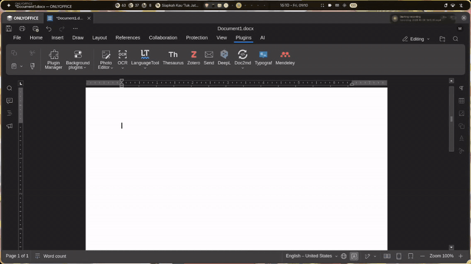
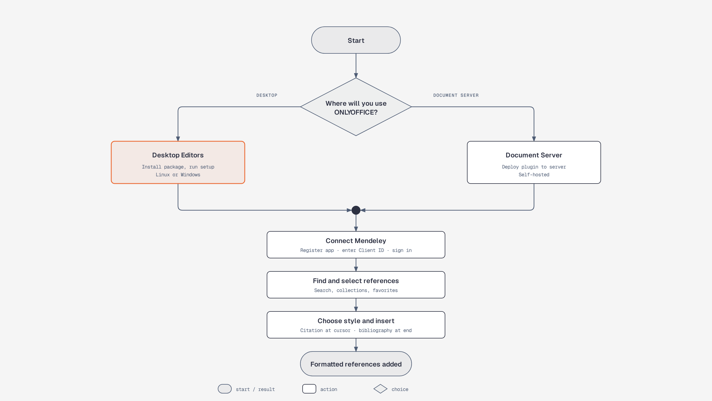
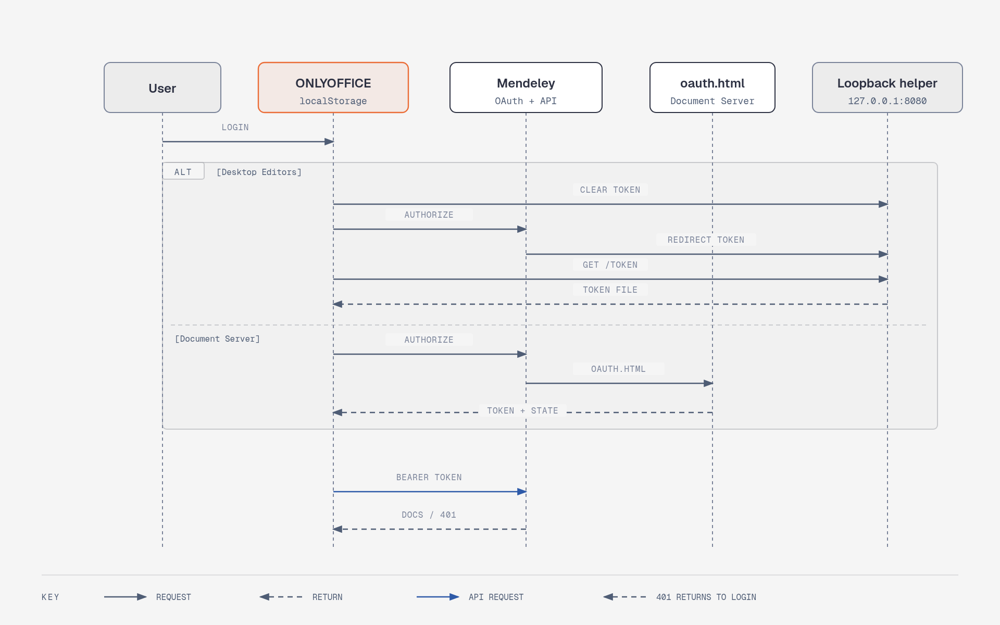

<div align="center">

# Mendeley for ONLYOFFICE

**Citations and bibliographies from Linux, without switching to Windows.**

[](LICENSE)
[](https://github.com/nashirabbash/plugin-mendeley/releases)

[](assets/demo_video.mp4)

*Find references, insert citations, and build bibliographies in ONLYOFFICE.*

</div>

## Why I built it

Ever found yourself switching from Linux to Windows and back just to add a Mendeley citation while writing a paper, report, or thesis? That gets tiring fast.

This plugin brings a Mendeley Cite-style workflow to ONLYOFFICE on Linux, so you can keep writing without switching operating systems. It is a fork of [ONLYOFFICE/plugin-mendeley](https://github.com/ONLYOFFICE/plugin-mendeley), adapted and extended for this use. Contributions and forks are welcome.

## What you can do

| Find references | Cite and format | Keep documents editable |
| --- | --- | --- |
| Search by title, author, or year. Browse collections, favorites, and recently added references. | Insert in-text citations and bibliographies. Choose styles such as APA, Chicago, and Harvard, plus citation language. | Edit existing citations or unlink them to convert citations to plain text. |



## Get started

### Requirements

- ONLYOFFICE Desktop Editors or a self-hosted ONLYOFFICE Document Server.
- A Mendeley account.
- A Mendeley OAuth application and its Client ID.

### ONLYOFFICE Desktop Editors

Install ONLYOFFICE Desktop Editors first. Download the installer for your operating system from [Releases](https://github.com/nashirabbash/plugin-mendeley/releases). Installer packages add the Mendeley plugin and its local helper; they do not install ONLYOFFICE.

#### Linux

Install the matching `.deb` or `.rpm` package, then run:

```bash
mendeley-onlyoffice-setup
```

Choose your ONLYOFFICE installation when prompted. Setup installs the plugin for your user and starts the helper. The helper starts again at your next login.

Before removing the package, run `mendeley-onlyoffice-remove` to remove the plugin, autostart entry, helper, and local token.

#### Windows

Run the Mendeley ONLYOFFICE installer and select your ONLYOFFICE plugin directory. The helper starts after setup and at your next sign-in.

In ONLYOFFICE Desktop Editors, open **Plugins** and select **Mendeley**.

### ONLYOFFICE Document Server

For a self-hosted Document Server, copy the plugin into its `sdkjs-plugins` directory. Example for a typical Linux installation:

```bash
sudo cp -r plugin-mendeley /var/www/onlyoffice/documentserver/sdkjs-plugins/mendeley
```

Adjust source and destination paths for your checkout and installation. If your server requires a plugin URL or configuration, add the plugin through its integration settings. Plugin GUID: `asc.{BE5CBF95-C0AD-4842-B157-AC40FEDD9441}`.

## Connect your Mendeley account

Register a Mendeley OAuth application. In the plugin's **Config** screen, save its Client ID and set the redirect URI to the address shown there:

- **Desktop Editors:** `http://localhost:8080/`
- **Document Server:** the HTTPS URL of the plugin's `oauth.html` page on your server.

Select **Login** in ONLYOFFICE and approve access on Mendeley's authorization page.



[View the standalone OAuth flow diagram](docs/mendeley-auth-sequence.html).

### Token behavior

The plugin sends the access token as a Bearer token when requesting library data. It does not refresh tokens automatically. If Mendeley rejects a token with `401`, the plugin clears its local session and asks you to sign in again.

- **Desktop Editors:** the helper at `127.0.0.1:8080` receives and saves a per-user token. The plugin reads it from the helper and stores its own copy in browser storage.
- **Document Server:** Mendeley redirects to `oauth.html`, which passes the token to the plugin window. The plugin stores the token in browser storage.

Logging out clears the plugin's browser-stored token. In Desktop Editors, the helper's saved copy remains, so the plugin can restore the session when reopened. Starting a new login clears that helper copy first.

## Use the plugin

1. Place the document cursor where you want the citation.
2. Find references by searching or browsing collections, **Favorites**, or **Recently Added**.
3. Select one or more references.
4. Choose a citation style and language.
5. Select **Insert citation** to add an in-text citation.
6. Select **Insert bibliography** to add the reference list at the end of the document.
7. Select the pencil icon beside a citation to edit it. Select **Unlink all** to convert citations to plain text.

## Troubleshooting

On CentOS with SELinux enabled, restore the security context after installation and restart the Document Server document service:

```bash
sudo restorecon -Rv /var/www/onlyoffice/documentserver/sdkjs-plugins/
sudo supervisorctl restart ds:docservice
```

If Mendeley login reports that port `127.0.0.1:8080` is in use, another application is using the port required by the local helper.

## Contributing

Bug reports and contributions are welcome through the [issue tracker](https://github.com/nashirabbash/plugin-mendeley/issues). This project is distributed under the [Apache License 2.0](LICENSE).
