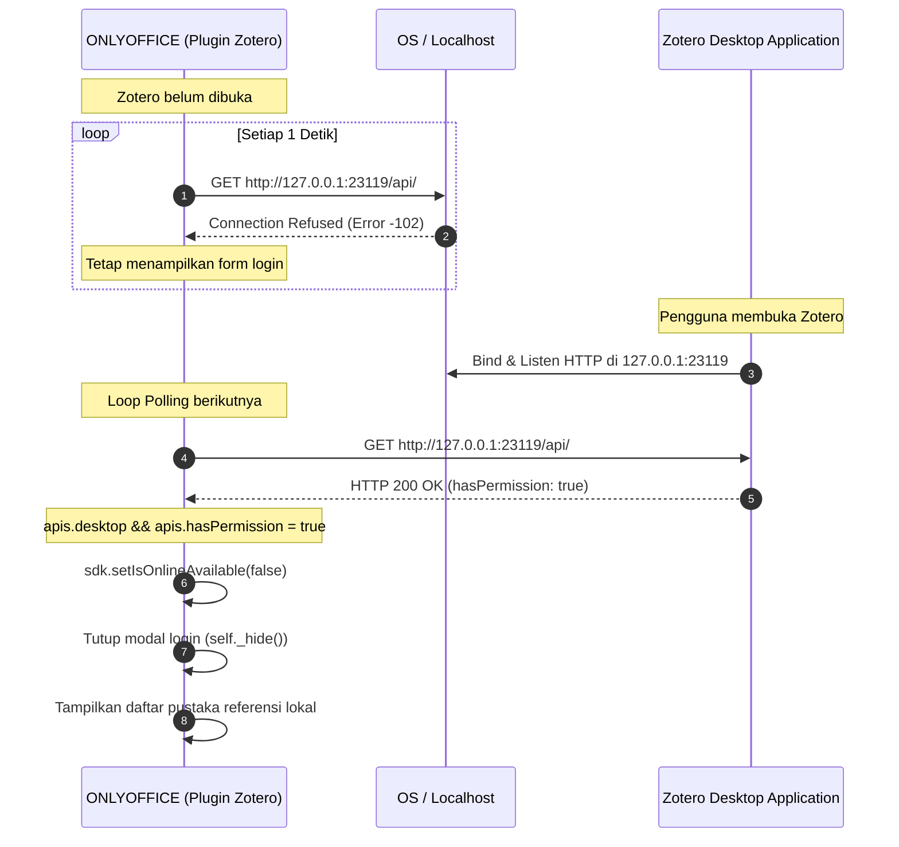

# Analisis Reverse Engineering: Sistem Autentikasi Plugin Zotero pada ONLYOFFICE

Dokumen ini menjelaskan hasil analisis *reverse engineering* terhadap mekanisme autentikasi dan integrasi plugin Zotero pada ONLYOFFICE Desktop Editors (`guid: asc.{BFC5D5C6-89DE-4168-9565-ABD8D1E48711}`), khususnya alasan mengapa plugin otomatis terhubung/login ketika aplikasi Zotero desktop dibuka.

---

## 1. Ringkasan Eksekutif

Plugin Zotero pada ONLYOFFICE beroperasi menggunakan **dua model komunikasi (Dual-Mode)**:
1. **Mode Online (Cloud)**: Mengakses `https://api.zotero.org/` menggunakan **API Key** dan **User ID**.
2. **Mode Desktop (Lokal)**: Mengakses server HTTP lokal Zotero di `http://127.0.0.1:23119/api/` **tanpa memerlukan password atau API Key** (*Zero-Auth Local Access*).

Alasan plugin otomatis "login" saat Zotero dibuka:
- Plugin ONLYOFFICE menjalankan **background polling berkala (setiap 1 detik)** ke port lokal Zotero (`23119`).
- Ketika aplikasi Zotero belum dibuka, koneksi ke port `23119` gagal (*Connection Refused*), sehingga plugin tetap menampilkan formulir login.
- Begitu Zotero dibuka, server HTTP internal Zotero aktif dan merespons `HTTP 200 OK`.
- Plugin menangkap status ini, menganggap pengguna terotorisasi, menutup jendela login secara otomatis, dan mengalihkan tampilan ke pustaka referensi lokal.

---

## 2. Arsitektur Komunikasi

Komponen konfigurasi URL ditentukan pada file `src/app/zotero/zotero-environment.js`:

```javascript
const zoteroEnvironment = {
    restApiUrl: "https://api.zotero.org/",
    desktopApiUrl: "http://127.0.0.1:23119/api/",
};

export { zoteroEnvironment };
```

| Parameter | Mode Online | Mode Desktop (Lokal) |
|---|---|---|
| **Base URL** | `https://api.zotero.org/` | `http://127.0.0.1:23119/api/` |
| **Kebutuhan Kredensial** | `Zotero-API-Key` & `userID` | **Tidak Ada** (*Zero-Auth*) |
| **Konektivitas** | Butuh koneksi internet | Offline / Lokal |
| **Identifikasi Klien** | API Key akun zotero.org | Header `User-Agent: AscDesktopEditor` |
| **Transport Bridge** | Standard `fetch()` | `window.AscSimpleRequest` (ONLYOFFICE C++ Native Bridge) |

---

## 3. Mekanisme Polling Deteksi (`zotero-api-checker.js`)

Deteksi status Zotero ditangani oleh modul `ZoteroApiChecker`.

### A. Polling Loop Setiap 1000 ms

```javascript
// src/app/zotero/zotero-api-checker.js
runApisChecker: function (sdk) {
    const self = this;
    self._done = false;

    function attemptCheck() {
        if (self._done) return;

        self._checkApiAvailable(sdk).then(function (res) {
            if (self._done) return;
            if (res.online && res.hasKey) {
                self._done = true;
            } else if (res.desktop && res.hasPermission) {
                self._done = true; // Hentikan polling jika desktop Zotero terdeteksi aktif
            }
            self._callback(res);
            setTimeout(attemptCheck, self._timeout); // _timeout = 1000 (1 detik)
        });
    }
    attemptCheck();
    ...
}
```

### B. Pengujian Koneksi ke Endpoint Lokal

Plugin memanggil endpoint lokal Zotero menggunakan native bridge ONLYOFFICE (`AscSimpleRequest`) untuk mem-bypass batasan browser/CORS:

```javascript
// src/app/zotero/zotero-api-checker.js
_sendDesktopRequest: function (url) {
    const self = this;
    return new Promise(function (resolve, reject) {
        if (!self._desktopVersion) {
            resolve({ hasPermission: false, isZoteroRunning: false });
            return;
        }
        window.AscSimpleRequest.createRequest({
            url: url, // http://127.0.0.1:23119/api/
            method: "GET",
            headers: {
                "Zotero-API-Version": "3",
                "User-Agent": "AscDesktopEditor",
            },
            complete: function (e) {
                let hasPermission = false;
                let isZoteroRunning = false;
                if (e.responseStatus == 403) {
                    hasPermission = false;
                    isZoteroRunning = true;
                } else if (e.responseStatus === 200) {
                    isZoteroRunning = true;
                    hasPermission = true;
                }
                resolve({ hasPermission, isZoteroRunning });
            },
            error: function (e) {
                if (e.statusCode == -102) e.statusCode = 404;
                reject(e);
            },
        });
    });
}
```

---

## 4. Transisi State Menuju Auto-Login (`login.js`)

Saat pengguna berada di layar login, komponen `LoginPage` mendengarkan hasil dari `runApisChecker`:

```javascript
// src/app/pages/login.js
apisChecker.subscribe(function (apis) {
    self._onChangeState(apis);
    ...
    if (apis.online && apis.hasKey) {
        self._sdk.setIsOnlineAvailable(true);
        self._hide(true);
        self._onAuthorized(apis);
        return;
    } else if (apis.desktop && apis.hasPermission) {
        // Zotero lokal terdeteksi aktif dan memiliki izin
        self._sdk.setIsOnlineAvailable(false); // Beralih ke offline/desktop mode
        self._hide();                          // Sembunyikan/tutup halaman login
        self._hideAllMessages();
        self._onAuthorized(apis);              // Picu alur terotorisasi
        return;
    }
});
```

Akibat logika di atas:
1. `self._sdk.setIsOnlineAvailable(false)` mengubah target query `_getBaseUrl()` ke `http://127.0.0.1:23119/api/`.
2. Halaman login otomatis ditutup tanpa memerlukan klik atau input apa pun dari pengguna.
3. Seluruh query pustaka (seperti `getItems` dan `getUserGroups`) selanjutnya diarahkan ke database lokal Zotero.

---

## 5. Model Keamanan Zotero (*Local Trust & Zero-Auth*)

Mengapa Zotero mengizinkan akses tanpa password/API Key?

1. **Loopback Trust Domain**: Port `23119` hanya di-bind ke antarmuka loopback (`127.0.0.1`). Layanan ini tidak terbuka ke jaringan eksternal/LAN.
2. **Izin Integrasi Eksternal**: Di aplikasi Zotero Desktop, terdapat preferensi bawaan:
   > **Edit → Settings → Advanced → *"Allow other applications on this computer to communicate with Zotero"***
3. **HTTP 403 Forbidden**: Jika opsi di atas dimatikan di Zotero, request ONLYOFFICE akan menerima status `403`. Plugin mendeteksi ini (`res.hasPermission = false`) dan akan menampilkan pesan peringatan yang meminta pengguna mengaktifkan pengaturan tersebut di Zotero.

---

## 6. Diagram Alir Interaksi



---

## 7. Lokasi File Terkait pada Sistem

Pada instalasi ONLYOFFICE Desktop Editors (Flatpak):
- **Direktori Plugin**: `/var/lib/flatpak/app/org.onlyoffice.desktopeditors/x86_64/stable/active/files/bin/opt/onlyoffice/desktopeditors/editors/sdkjs-plugins/{BFC5D5C6-89DE-4168-9565-ABD8D1E48711}/`
- **File Utama**:
  - `src/app/zotero/zotero-environment.js`: Konfigurasi endpoint Online vs Desktop.
  - `src/app/zotero/zotero-api-checker.js`: Logika polling (1 detik) dan cek port 23119.
  - `src/app/zotero/zotero.js`: Implementasi client Zotero SDK dan perutean request.
  - `src/app/pages/login.js`: Logika UI login dan trigger auto-login.
